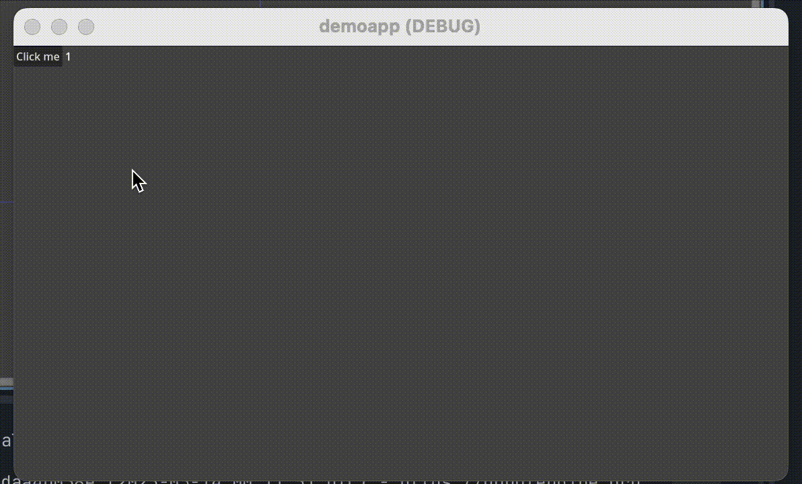

# Vue Godot

A small simple project that bridges Vue.js and Godot.

This project is for:

- Write game UI using Vue.js
- Write cross platform applications using Vue.js with Godot as the runtime

This project is far from production ready. follow me on [@juryxiong](https://x.com/juryxiong) for updates.

```vue
<template>
  <HBoxContainer>
    <Button :text="'Click me'" @pressed="handleClick"></Button>
    <Label :text="count"></Label>
  </HBoxContainer>
</template>

<script setup lang="ts">
// Test.vue
import { ref } from 'vue'

const count = ref(1)

const handleClick = () => {
  count.value = count.value + 1
}
</script>
```

```ts
// main.ts
import { createApp } from '@vue-godot/runtime-tscn'
import { Control } from 'godot'
import Test from './Test.vue'

export default class App extends Control {
  _ready() {
    const app = createApp(Test)
    app.mount(this)
  }
}
```



## Getting Started

Download GodotJS editor from https://github.com/ialex32x/GodotJS-Build/releases

```bash
npm install
npm run build:demo
```

Open GodotJS editor and open `apps/v-on/project.godot`
