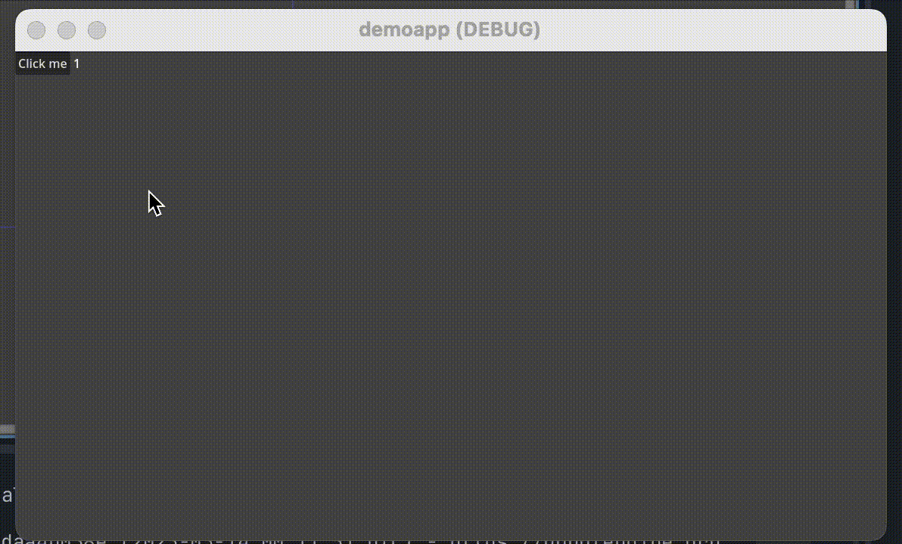

# Vue Godot

**Write native apps and Godot game UI using Vue.js.**

Vue Godot renders Vue Single File Components into Godot's native scene tree.
Use Godot nodes directly or use HTML-like components backed by Godot controls.



## Start a project

Create a native app:

```bash
npx vue-godot create app my-app
```

Create game UI:

```bash
npx vue-godot create game-ui my-hud
```

Both profiles scaffold the same Vue + Godot foundation: `app` starts with
application-oriented UI that demonstrates storage, network state, and native
capability adapters, while `game-ui` starts with a HUD-oriented screen of
health, actions, and session controls. Choose either as a starting point—the
difference is the starter content, not a runtime limitation.

Then install the standalone runtime, generate stock-Godot declarations, and
start the Vue build:

```bash
cd my-app # or my-hud
npm install
npm run setup:runtime
npm run dev
```

Open `project.godot` in an
[official Godot editor](https://godotengine.org/download/) and press **F5**.
Use `npm run build` for a one-time build. The generated project installs
`godot-js-runtime` under `addons/godot-js-runtime`; no custom editor is needed.

The `app` profile includes HTML-like components, browser APIs, and native
capability adapters. Add only the starters you need:

```bash
npx vue-godot create app my-app --router --storage --network --device-api
```

For a minimal project using Godot nodes directly, run:

```bash
npx vue-godot create my-game
```

Add `--html` to include components such as `<Div>`, ``, `<Button>`, and
`<Input>`.

### Add Vue to an existing Godot project

```bash
cd my-existing-godot-project
npx vue-godot integrate --html
npm install
npm run gen:types
npm run dev
```

## Write Vue components

Godot node classes work as Vue component tags:

```vue
<template>
  <HBoxContainer>
    <Button text="Add one" @pressed="increment"></Button>
    <Label :text="`Count: ${count}`"></Label>
  </HBoxContainer>
</template>

<script setup lang="ts">
import { ref } from 'vue'

const count = ref(0)

const increment = () => {
  count.value += 1
}
</script>
```

With `--html`, familiar HTML-like components render to Godot nodes too:

```vue
<Div :style="{ flexDirection: 'row', gap: 12 }">
  <Span>Count: {{ count }}</Span>
  <Button @click="increment">Add one</Button>
</Div>
```

Both styles can be used in the same template.

## Packages

| Package                                                        | Purpose                                                     |
| -------------------------------------------------------------- | ----------------------------------------------------------- |
| [`godot-js-runtime`](./packages/godot-js-runtime/README.md)    | Run JavaScript or compiled TypeScript in official Godot     |
| [`@vue-godot/runtime-tscn`](./packages/runtime-tscn/README.md) | Render Vue components into the Godot scene tree             |
| [`@vue-godot/html`](./packages/html/README.md)                 | Use HTML-like components backed by Godot nodes              |
| [`@vue-godot/browser`](./packages/browser/README.md)           | Use browser-like APIs such as `fetch`, `URL`, and `history` |
| [`@vue-godot/device`](./packages/device/README.md)             | Register typed native capability adapters                   |
| [`@vue-godot/cli`](./packages/cli/README.md)                   | Create projects, integrate Vue, and generate types          |
| [`vue-godot`](./packages/vue-godot/README.md)                  | Run the CLI with `npx vue-godot`                            |

## Examples

- [`apps/js-runtime-demo`](./apps/js-runtime-demo) — standalone TypeScript on
  official Godot, with no Vue dependency
- [`apps/native-app-demo`](./apps/native-app-demo) — routing, storage, network,
  permissions, and device APIs
- [`apps/game-ui-demo`](./apps/game-ui-demo) — HUD, input, media, settings, and
  inventory
- [`apps/html-demo`](./apps/html-demo) — HTML-like components and browser APIs

Smaller examples cover Vue events, `v-model`, template refs, lifecycle hooks,
and node ordering under [`apps`](./apps). See the
[example app criteria](./docs/example-apps.md) for maintained coverage.

## Requirements

- Node.js 20 or newer
- Official Godot 4.4 or newer
- `godot-js-runtime`, installed by the generated `npm run setup:runtime` command

## Documentation

- [Compatibility](./docs/compatibility.md) and
  [runtime behavior](./docs/runtime.md)
- [Permissions and exports](./docs/permissions.md) and
  [native plugins](./docs/plugins.md)
- [Routing](./docs/routing.md) and [migration](./docs/migration.md)
- Platform guides for [desktop](./docs/platforms/desktop.md),
  [Android](./docs/platforms/android.md), and [iOS](./docs/platforms/ios.md)
- [Troubleshooting](./docs/troubleshooting.md)
- [Roadmap](./docs/roadmap.md)
- [Standalone Godot JavaScript GDExtension implementation plan](./docs/godot-js-gdextension-plan.md)

## Development

```bash
npm install
npm run build
npm run test
npm run check
```

`npm run check` runs the full local quality gate. Godot smoke tests can use a
specific executable with `GODOT_BIN=/path/to/godot npm run smoke:godot`.

## License

MIT
