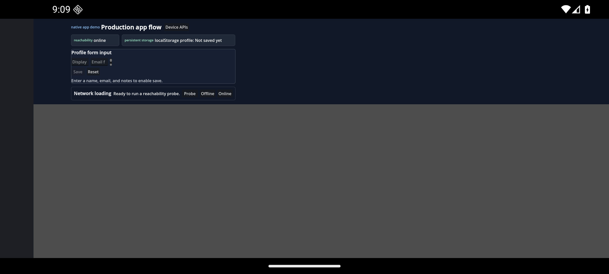
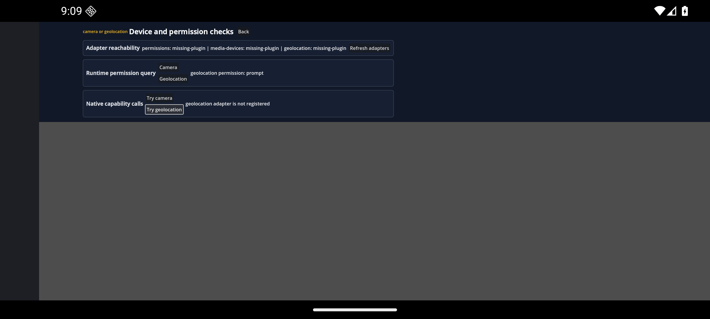
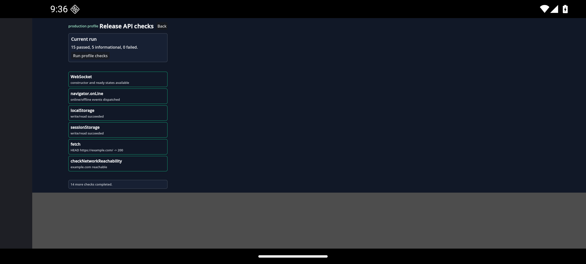

# Android Emulator Smoke - 2026-07-07

This records a partial native app Android export smoke run. It proves the
`native-app-demo` Android export can build, install, cold-launch, render the
Vue routes, report selected device adapter states, and run the release-check
screen on an emulator. It does not complete the final release Android
production-profile worksheet in `release/platform-evidence.json`.

## Target

- Date: 2026-07-07
- Test target: emulator
- Emulator: `emulator-5554`
- Device model: `sdk_gphone64_arm64`
- Android release: `16`
- Android API level: `36`
- Orientation: landscape
- Locale: default emulator locale
- GodotJS: `4.4.1.rc.custom_build.daa4b058e`

## Artifact

- APK: `apps/native-app-demo/build/android/native-app-demo-debug.apk`
- SHA-256: `c254ac154365277527be9546bac51247d0eec810c484453a392e66e78e762a05`
- Package: `org.vuegodot.nativeappdemo`
- Version: `1.0.0`
- compileSdk: `34`
- minSdk: `24`
- targetSdk: `34`
- Launch activity: `com.godot.game.GodotApp`
- Signature verification: APK Signature Scheme v2, one signer

## Export Settings

The Android preset exports a Gradle debug build with these tested permissions:

- `android.permission.ACCESS_COARSE_LOCATION`
- `android.permission.ACCESS_FINE_LOCATION`
- `android.permission.CAMERA`
- `android.permission.INTERNET`
- `android.permission.POST_NOTIFICATIONS`
- `android.permission.RECORD_AUDIO`
- `android.permission.VIBRATE`

## Commands

```bash
npm run build --workspace=native-app-demo
ANDROID_HOME=/opt/homebrew/share/android-commandlinetools \
ANDROID_SDK_ROOT=/opt/homebrew/share/android-commandlinetools \
JAVA_HOME=/opt/homebrew/opt/openjdk@17/libexec/openjdk.jdk/Contents/Home \
GODOT_ANDROID_KEYSTORE_DEBUG_PATH="$HOME/.android/debug.keystore" \
GODOT_ANDROID_KEYSTORE_DEBUG_USER=androiddebugkey \
GODOT_ANDROID_KEYSTORE_DEBUG_PASSWORD=android \
"$GODOT_BIN" --headless --path apps/native-app-demo \
  --export-debug Android \
  "$(pwd)/apps/native-app-demo/build/android/native-app-demo-debug.apk"
adb -e install -r apps/native-app-demo/build/android/native-app-demo-debug.apk
adb -e shell am start -n org.vuegodot.nativeappdemo/com.godot.game.GodotApp
```

## Results

- Build succeeded.
- Android export succeeded.
- APK installed successfully on the emulator.
- Cold launch reached `org.vuegodot.nativeappdemo/com.godot.game.GodotApp`.
- The app process stayed alive and owned emulator focus after launch, device API
  taps, and the release-check batch.
- GodotJS startup log included `jsb.inject loaded successfully`,
  `OnGodotSetupCompleted`, and `OnGodotMainLoopStarted`.
- Filtered logcat after the guarded camera/geolocation taps had no
  `unhandled promise rejection`, `E AndroidRuntime`, crash, fatal, or GodotJS
  load-diagnostic lines.
- The home route rendered instead of a blank memory-router route.
- The device API route reported adapter states:
  `permissions: missing-plugin`, `media-devices: missing-plugin`,
  `geolocation: missing-plugin`.
- `navigator.permissions.query({ name: 'geolocation' })` reported `prompt`.
- The camera action reported `media-devices adapter: missing-plugin` without
  invoking `getUserMedia()` on an unregistered adapter.
- The geolocation action reported `geolocation adapter is not registered`.
- The release-check screen completed with `15 passed`, `5 informational`, and
  `0 failed`.
- The release-check batch covered WebSocket constructor constants,
  `navigator.onLine` events, local/session storage, `fetch`, network
  reachability, permission query states, clipboard support, native adapter
  states, guarded media/geolocation calls, vibration, sensors, and layout
  primitives.

## Screenshots








## Remaining Release Work

This is narrower than the maintained production profile. The final Android
release gate still needs the full `release/platform-evidence.json` Android
worksheet to pass, including storage restart, Android back handling,
background/foreground, complete evidence capture for every required row, and the
selected native adapter success or accepted fallback states required by the
release checklist.
