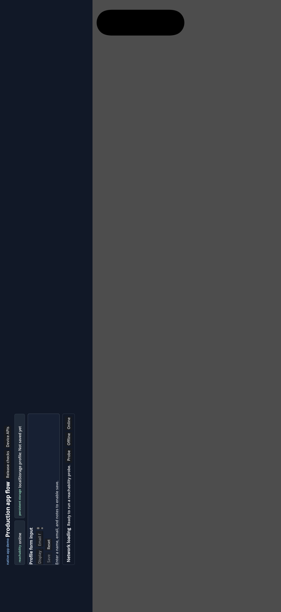

# iOS Simulator Smoke - 2026-07-07

Release-candidate context:

- Commit under test: local working tree after `b57fb28`, with the unattended release-check launch hook and virtual-keyboard/text-control release check.
- Target: iPhone 17 simulator, iOS 26.5, Xcode 26.6.
- Export preset: `iOS Release` using Godot project-only Xcode export.
- Runtime: locally built GodotJS iOS simulator template using JavaScriptCore.
- App executable SHA-256: `9913f81d05c2a89a0277e639cf4efe0930b28e682f59566a8b23437abf2820ef`.
- App pack SHA-256: `093b182310bf2fed10bfb4ab666a84b728433e20c35ff4fb7320262ec444e5a8`.

Important caveat: the published GodotJS 4.4 V8 iOS release assets provide
device `arm64` static libraries, not simulator slices. This simulator smoke used
a locally built JavaScriptCore simulator slice and linked `JavaScriptCore.framework`.
It verifies the iOS export project, simulator launch, app rendering, and
production-profile API behavior on iOS Simulator. It does not replace a signed
physical-device V8 run.

## Build And Launch

The Vue bundle was rebuilt:

```bash
npm run build --workspace=native-app-demo
```

The Godot project-only iOS export succeeded:

```bash
GODOT_BIN="$(npm run -s setup:godotjs -- --print-bin)"
"$GODOT_BIN" --headless --path apps/native-app-demo --export-debug "iOS Release" build/ios/native-app-demo
```

The generated Xcode project was built for the iPhone 17 simulator after applying
the local simulator-only project adjustments:

- remove generated `MoltenVK.xcframework` and `MetalFX.framework` references not
  present in the local simulator package/SDK;
- link `JavaScriptCore.framework` for the JavaScriptCore-backed simulator slice.

```bash
xcodebuild \
  -project apps/native-app-demo/build/ios/native-app-demo.xcodeproj \
  -scheme native-app-demo \
  -configuration Debug \
  -destination 'platform=iOS Simulator,name=iPhone 17' \
  -derivedDataPath /tmp/vue-godot-ios-derived \
  CODE_SIGNING_ALLOWED=NO \
  'OTHER_LDFLAGS=$(LD_CLASSIC_$(XCODE_VERSION_ACTUAL)) -framework JavaScriptCore' \
  build
```

The app was launched with the unattended release-check hook and an 8 second
delay. During the delay, Settings was launched to background the app, then the
native demo was foregrounded again:

```bash
SIMCTL_CHILD_VUE_GODOT_RELEASE_CHECKS=1 \
SIMCTL_CHILD_VUE_GODOT_RELEASE_CHECKS_DELAY_MS=8000 \
xcrun simctl launch --terminate-running-process --console \
  6705F08F-38D3-4650-8AAE-BD4715D180ED \
  org.vuegodot.nativeappdemo
```

## Evidence



[Release check log excerpt](./evidence/ios-simulator-release-checks-2026-07-07.log)

Lifecycle release-check summary:

```text
[JS] [native-release-checks] summary passed=18 info=6 failed=0
[JS] [native-release-checks] pass storage restart marker: localStorage restored and sessionStorage reset for this runtime
[JS] [native-release-checks] pass fetch: HEAD https://example.com/ -> 200
[JS] [native-release-checks] pass checkNetworkReachability: example.com reachable
[JS] [native-release-checks] pass navigator.clipboard: write/read succeeded
[JS] [native-release-checks] pass readDeviceMotion: accel=0.00,0.00,0.00 absolute=false
[JS] [native-release-checks] pass background/foreground lifecycle: blur=1 focus=1
[JS] [native-release-checks] native-app-demo passed
```

The virtual-keyboard/text-control follow-up log is recorded at
[`ios-simulator-text-input-release-checks-2026-07-07.log`](./evidence/ios-simulator-text-input-release-checks-2026-07-07.log).
It exercises the `DisplayServer` virtual-keyboard API, installs the input text
callback, and verifies the Godot text controls that back `<Input>` and
`<Textarea>` accept inserted text:

```text
[JS] [native-release-checks] summary passed=18 info=7 failed=0
[JS] [native-release-checks] pass SafeAreaView/KeyboardAvoidingView: screen is rendered inside both layout primitives
[JS] [native-release-checks] pass virtual keyboard text input: feature=true callback=installed LineEdit=inserted TextEdit=inserted beforeHeight=0 shownHeight=0 hiddenHeight=0 callbackEvents=0
[JS] [native-release-checks] native-app-demo passed
```

The simulator kept the software-keyboard height at `0` and did not deliver a
callback text event, consistent with the simulator hardware-keyboard path. This
evidence covers the runtime APIs and Godot text controls on the simulator; it
does not replace a signed physical-device V8 run for final release wording.

Informational rows were expected for plugin-backed APIs on this simulator:
permissions, geolocation, media devices, `getUserMedia`, geolocation calls, and
Android Back handling.
